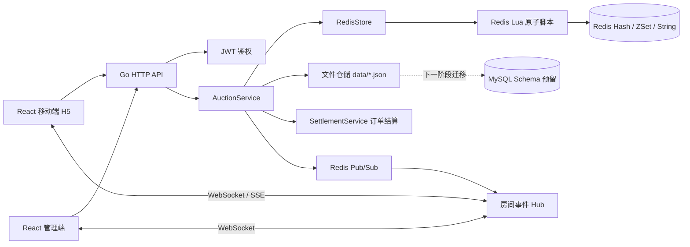

# 抖音电商 AI 全栈挑战赛 - 成果演示

## 1. 课题名称

实时竞拍大师：抖音电商直播竞拍全栈系统

## 2. 团队名称与成员名单

- 团队形式：个人完成
- 成员：王晓龙
- 学校：华南理工大学
- 专业：电子信息
- 角色：全栈开发

## 3. 分工说明

本项目由个人独立完成，覆盖产品方案、前后端开发、实时竞拍核心链路、Redis 原子出价设计、WebSocket 同步、测试验证和演示材料整理。

- 产品与流程设计：直播竞拍业务流程、管理端和用户端交互路径设计
- 后端开发：Go HTTP API、JWT 登录鉴权、竞拍状态机、订单结算、文件仓储
- 实时能力：WebSocket/SSE 推送、房间级事件隔离、Redis Pub/Sub 多实例事件边界
- Redis 核心链路：Lua 原子出价、幂等请求、排行榜、自动延时、封顶成交
- 前端开发：React + TypeScript 管理端、移动端 H5、实时排行榜和出价交互
- 测试与验证：Go 单元测试、Redis 集成测试、Playwright 多用户端到端测试

## 4. 核心功能清单

1. 管理端竞拍发布：商家配置商品名称、图片、介绍、起拍价、加价幅度、竞拍时长、封顶价和自动延时规则。
2. 竞拍生命周期管理：支持 DRAFT、RUNNING、SOLD、ENDED、CANCELLED 状态流转，管理端可启动或取消竞拍。
3. 用户端实时出价：用户登录后进入移动端竞拍房间，查看当前价、倒计时、最低有效出价和个人排名。
4. Redis 原子竞价：使用 Redis Hash/ZSet/String + Lua 脚本完成出价校验、价格更新、Top 5 排行榜、幂等和自动延时。
5. 实时同步与恢复：WebSocket 按竞拍房间广播事件，前端断线后自动重连，并通过 snapshot 恢复最新状态。
6. 成交与订单闭环：达到封顶价立即成交，到时自动结算；成交后生成最小订单记录，支持结果查询。

## 5. 端到端使用流程

1. 管理员使用 `admin / admin123` 登录管理端。
2. 管理员创建竞拍商品，填写竞拍规则并发布到竞拍列表。
3. 管理员启动竞拍后，系统将竞拍状态切换为 `RUNNING`，并初始化 Redis 实时快照。
4. 用户使用 `userA / 123456`、`userB / 123456` 等账号登录移动端，进入对应竞拍房间。
5. 用户根据页面展示的最低有效出价提交报价，后端通过 Redis Lua 原子校验并更新当前最高价。
6. 管理端和所有用户端通过 WebSocket 实时收到出价、排行榜、延时、成交或取消事件。
7. 若用户在结束前窗口内有效出价，系统自动延长竞拍时间；若出价达到封顶价，则立即成交。
8. 竞拍结束后，系统生成订单并保留结果，用户端和管理端可看到最终状态。

## 6. 在线 Demo 链接

暂未部署线上 Demo，本次提交以 B 站录屏演示替代。

- 演示视频：https://www.bilibili.com/video/BV1tJV96KEQN/

## 7. 演示视频链接

https://www.bilibili.com/video/BV1tJV96KEQN/?spm_id_from=333.1387.homepage.video_card.click&vd_source=2490f5964edb0d1a674e5d4c72bfb722

视频重点展示：

1. 管理端登录、创建竞拍、启动竞拍。
2. 用户 A 和用户 B 分别登录移动端参与同一场竞拍。
3. 用户出价后管理端和用户端同步刷新当前价、Top 5 排行榜和个人排名。
4. 低价/非法出价被拦截，页面返回下一次最低有效价。
5. 临近结束出价触发自动延时。
6. 达到封顶价后竞拍进入 SOLD，并生成成交订单。

## 8. 源代码仓库链接

- GitHub 仓库：https://github.com/aaa-wxl/DYZBJJ
- 最终提交分支：`main`
- 开发分支：`feat/store`，已合并至 `main`
- 最后提交：以 GitHub `main` 分支最新提交为准

## 9. README / 运行说明

项目 README 已包含项目简介、技术栈、启动步骤、核心 API 和手工验证清单。

### 依赖环境

- Go 1.22+
- Node.js 20+
- Docker / Docker Compose
- Redis 7
- MySQL 8 预留

### 本地启动

启动 Redis 和 MySQL：

```powershell
docker compose up -d redis mysql
```

启动后端：

```powershell
$env:REDIS_ADDR="127.0.0.1:6379"
$env:HTTP_ADDR="127.0.0.1:8080"
go run ./cmd/api
```

启动前端：

```powershell
cd web
$env:VITE_API_BASE="http://127.0.0.1:8080"
npm run dev -- --host 127.0.0.1 --port 5173
```

访问入口：

- 管理端：`http://127.0.0.1:5173/admin`
- 用户端：`http://127.0.0.1:5173/m`

体验账号：

- 管理员：`admin / admin123`
- 用户 A：`userA / 123456`
- 用户 B：`userB / 123456`
- 用户 C：`userC / 123456`

### 测试命令

```powershell
go test -count=1 ./...
```

```powershell
cd web
npm run build
```

如需运行端到端测试：

```powershell
docker compose up -d redis mysql
cd web
npm run test:e2e
```

## 10. 系统架构图



## 11. 大模型 / AI 能力使用说明

本项目当前没有在运行时接入大模型 API、Agent、RAG 或向量库能力。AI 能力主要体现在工程开发过程中的辅助设计、代码生成、测试补齐和文档整理。

AI 辅助工程使用方式：

- 需求拆解：根据挑战赛 PRD 拆分管理端、用户端、后端、Redis、实时通信和测试任务。
- 架构设计：辅助梳理 Redis 实时竞拍核心链路、状态机、幂等策略和多端同步方案。
- 代码实现：辅助生成 Go/React/TypeScript 代码骨架，并由人工检查业务边界和状态流转。
- 测试补齐：辅助设计单元测试、Redis 集成测试和 Playwright 多用户 E2E 场景。
- 文档沉淀：辅助整理 README、设计文档、演示材料和答辩说明。

人工把控点：

- 竞拍状态机和出价规则由人工确认，避免 AI 生成代码遗漏业务约束。
- Redis Lua 原子出价逻辑经过测试覆盖，重点验证并发、幂等、封顶成交和自动延时。
- 项目材料中如实说明 AI 用于工程辅助，不夸大为系统运行时大模型能力。

## 12. 关键工程难点与解决方案

### 难点一：高并发出价下的价格一致性

直播竞拍场景中，多名用户可能在同一时刻提交出价。如果只在应用层加锁，单机可以工作，但多实例部署后容易出现价格回退、重复写入或排行榜错乱。

解决方案：

- 将实时竞拍状态迁移到 Redis。
- 用 Lua 脚本在 Redis 内原子完成校验和更新。
- 一次脚本内完成状态检查、最低价计算、加价幅度校验、最高价更新、排行榜更新和幂等结果写入。
- 使用 requestId 做幂等 key，重复请求返回第一次结果，避免重复扣写出价流水。

### 难点二：排行榜和个人排名实时一致

用户端既要看到 Top 5 排行榜，也要看到自己的当前排名。若排行榜依赖后端内存，刷新或多实例部署时会不一致。

解决方案：

- 使用 Redis ZSet 维护用户最高出价排序。
- 使用组合 score：`amount * 1000000000 - seq`，保证金额优先，同价按先到先得排序。
- 使用 Hash 保存用户对应金额，避免从 score 反推金额。
- 每次用户进入或重连时读取 snapshot，恢复最新排名和房间状态。

### 难点三：实时同步和断线恢复

WebSocket 连接可能因为网络波动断开，如果只依赖事件流，用户重连后可能丢失竞拍状态。

解决方案：

- WebSocket 用于实时事件广播，snapshot 用于权威状态恢复。
- 前端检测连接关闭后自动重连。
- 重连前先请求 `/api/auctions/{id}/snapshot`，保证页面恢复到最新状态。
- Redis Pub/Sub 作为多实例事件边界，后续可横向扩展多个 API 实例。

### 难点四：竞拍终态和订单幂等

封顶成交和自然结束都可能触发订单生成，若处理不当容易重复生成订单。

解决方案：

- 竞拍状态进入 `SOLD` 后由 `SettlementService` 生成订单。
- Repository 层通过 auctionId 保证一场竞拍最多对应一个订单。
- 达到封顶价时停止结束定时器，避免封顶成交后再次自然结算。

## 13. 项目亮点 / 创新点

1. Redis Lua 承接竞拍最核心路径，真实解决高频出价下的一致性、幂等和排行榜问题。
2. 双端实时联动完整，管理端和移动端可同时观察竞拍状态、价格变化、排行榜和成交结果。
3. 竞拍规则闭环较完整，覆盖起拍价、加价幅度、封顶成交、自动延时、异常取消、到点结算和订单生成。

## 14. 其余材料

### 14.1 性能指标 / 压测结果

当前尚未形成正式压测报告。已有工程验证覆盖：

- Go 后端全量测试：`go test -count=1 ./...` 通过。
- 前端生产构建：`npm run build` 通过。
- Redis 并发测试覆盖：并发出价不会导致价格回退。
- Playwright E2E 覆盖：多用户登录、出价、排行榜同步、刷新后身份和排名稳定。

后续可补充正式压测：

- 单直播间 100、500、1000 并发出价请求。
- 出价接口 P50 / P95 / P99 延迟。
- WebSocket 房间广播延迟。
- Redis Lua 脚本平均执行耗时。

### 14.2 Prompt 策略 / AI 辅助流程

AI 辅助流程主要围绕“需求拆解 -> 方案设计 -> 小步实现 -> 测试验证 -> 文档沉淀”展开。

关键 Prompt 方向：

- 根据 PRD 拆解直播竞拍系统的前端、后端、Redis 和测试任务。
- 设计 Redis 原子出价流程，要求覆盖幂等、自动延时、封顶成交和排行榜。
- 为 Go 服务补充状态机、仓储、鉴权、WebSocket 和订单测试。
- 为 React 双端页面补充管理端和移动端用户路径。
- 将实现结果整理成答辩材料，区分已实现能力和下一阶段规划。

### 14.3 评测方案与样例结果

样例输入：

- 管理端创建竞拍：起拍价 0，加价幅度 100，封顶价 500，延时窗口 20 秒，延长 30 秒。
- 用户 A 出价 100。
- 用户 B 出价 200。
- 用户 B 再出价 500。

样例结果：

- 用户 A 出价后，当前价变为 100，排行榜第 1 名为用户 A。
- 用户 B 出价 200 后，当前价变为 200，用户 B 排名第 1，用户 A 排名第 2。
- 用户 B 出价 500 后，达到封顶价，竞拍状态进入 `SOLD`。
- 系统生成订单，订单状态为 `PENDING_PAYMENT`。

### 14.4 用户反馈 / 内测记录

暂无正式用户反馈记录。本次提交以本地端到端演示和自动化测试结果作为可用性证明。
